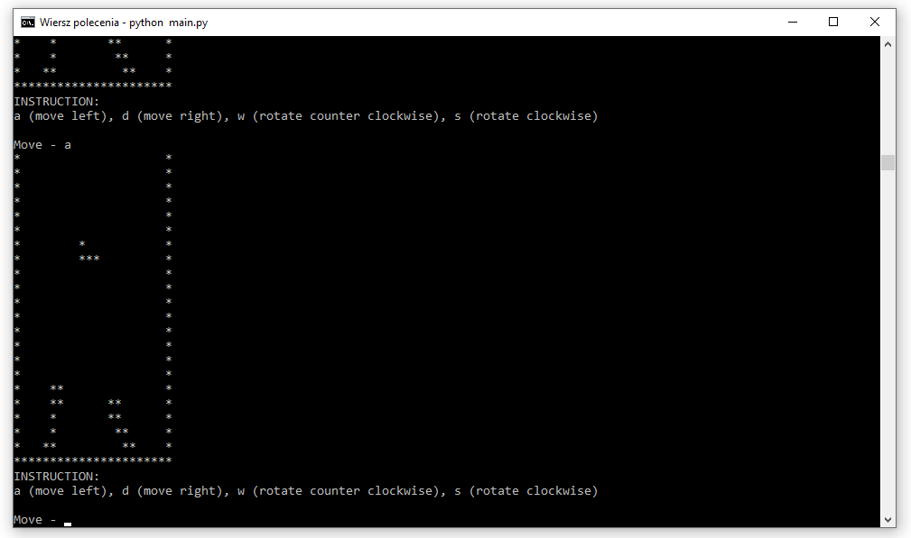

# Tetris
This application enables to play simplified Tetris game.

## Table of contents
* [Screenshots](#screenshots)
* [Technologies](#technologies)
* [Setup](#setup)
* [Features](#features)
* [Status](#status)
* [Contact](#contact)

## Screenshots

## Technologies
* Python 3.9
* random
* copy

## Setup
To run Tetris you will need to: 
* Clone this repository to your computer or download and unpack .zip file in chosen directory
* Run comand line
* Type "python [YOUR_TETRIS_DIRECTORY]\main.py"
After those steps the game is ready to play.

## Features
* Display board and pieces,
* Move and rotate pieces,
* Updating board after user's move.

## Status
The project is ready for use, but doesn't have all Tetris functions like cleaning fullfilled rows or counting points.

## Contact
Created by [@matedawid](https://linkedin.com/in/matedawid) - if you have any questions, just contact me!
